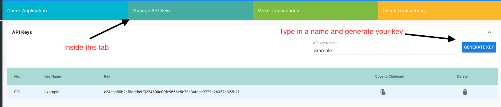

   
******************
SIMBA Chat
******************

Using SIMBA Chain

==============

`Here <https://www.youtube.com/watch?v=1BatYaRD60c&list=PLgfX2jfDfJNMEqF_xjZBYmavONXeRK_q5>`_ is a playlist on the SIMBA Chain Youtube channel to get you up to speed on using the dashboard.

.. _contract:
Smart Contract
************

pragma solidity ^0.4.24;

contract Application {
    function Application() public {}
    enum Assets {
        chatRoom, message
    }
    Assets _message = Assets.chatRoom;
    Assets _createRoom = Assets.chatRoom;
    Assets _sendMessage = Assets.message;

    function message (
        string assetId)    /* parameter needed for linking assets and transactions */
    public {}

    function createRoom (
        string assetId, /* parameter needed for linking assets and transactions */
        string name, /* optional parameter */
        string createdBy)   /* optional parameter */
    public {}

    function sendMessage (
        string assetId, /* parameter needed for linking assets and transactions */
        string message, /* optional parameter */
        string sentBy, /* optional parameter */
        string chatRoom, /* optional parameter */
        string _bundleHash)   /* optional parameter */
    public {}
}

.. _dashboard:
Creating an app on the SIMBA Dashboard
***************
Before Starting make sure you have an account on the Simba Dashboard and an Ethereum wallet with Ether in it on the Circle of life network

* Create The Smart Contract
* Create The Application
* Configure The Application(Ethereum Blockchain, Circle of Life, IPFS Filesystem, Permission disabled)
* Generate API Key(This is not the API name)

Converting the SimbaChat example to your app
***************
* Setting the Env Variables
   * To set the signing key: firebase functions:config:set signing.key=“[YOUR PRIVATE KEY WITHOUT THE 0x]”
   * To set the api key: firebase functions:config:set simba.key=“[YOUR API KEY]”
* Setting the public address
   * At line 41: const from = "[YOUR PUBLIC ETHEREUM KEY]";
* Changing the url
   * At line 44: const baseUrl = "[YOUR URL TO SIMBACHAIN API(example:https://api.simbachain.com/v1/simbaChatz)]";
* Deploying the application
   * Guide for setting up the firebase application. https://firebase.google.com/docs/web/setup
   * Guide for setting up the hosting for firebase. https://firebase.google.com/docs/hosting/quickstart
   * Based off of this firebase example application. https://codelabs.developers.google.com/codelabs/firebase-web/#0

Github Repo https://github.com/SIMBAChain/SimbaChat
